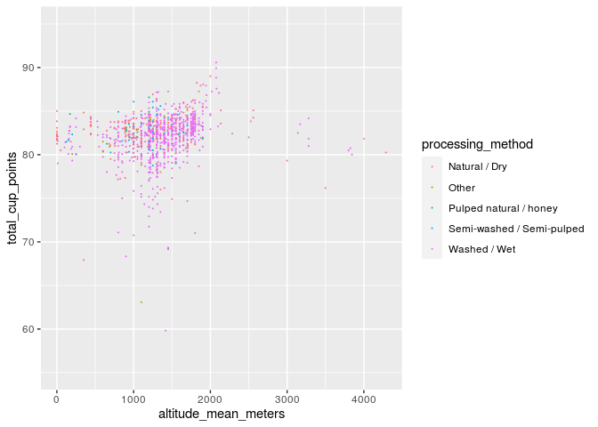
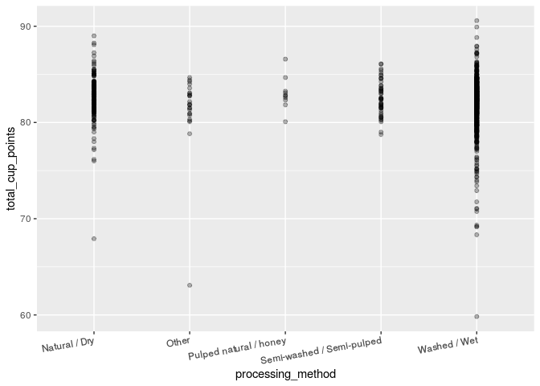
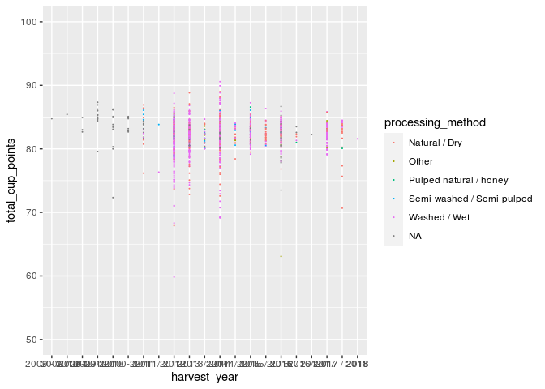
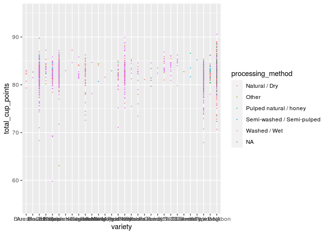
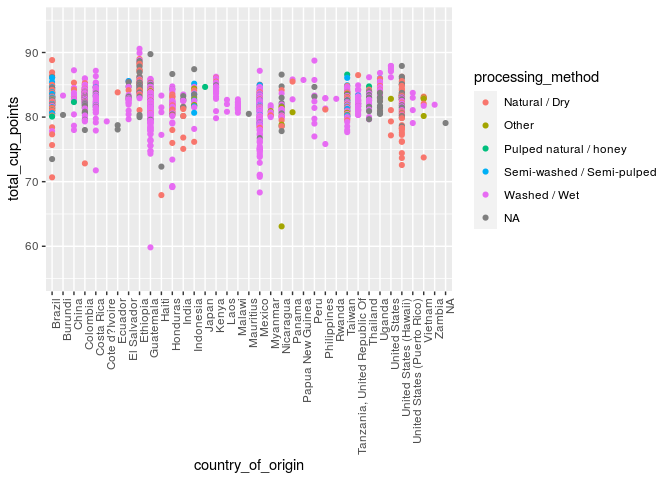
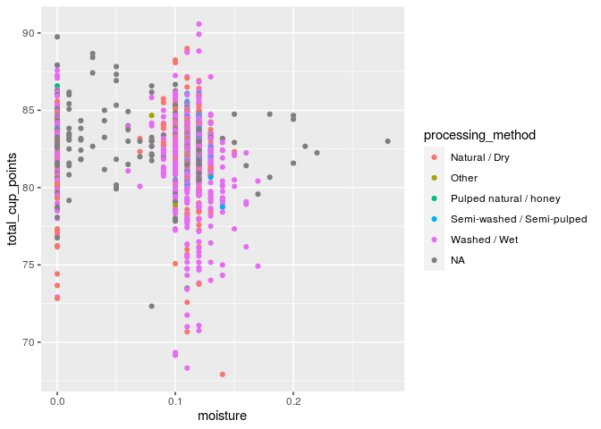
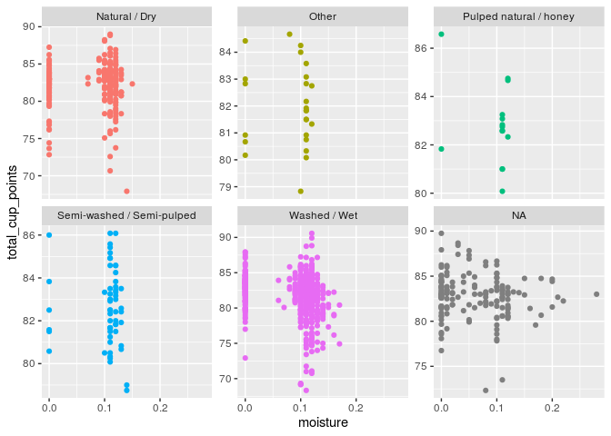
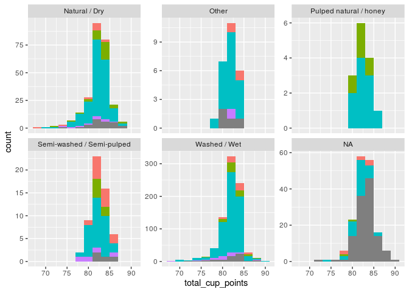

Project proposal
================
percent\_percentage

``` r
library(tidyverse)
library(broom)
library(pillar)
library(ggplot2)
```

    ## Warning: Missing column names filled in: 'X1' [1]

    ## 
    ## ── Column specification ────────────────────────────────────────────────────────
    ## cols(
    ##   .default = col_character(),
    ##   X1 = col_double(),
    ##   Number.of.Bags = col_double(),
    ##   Aroma = col_double(),
    ##   Flavor = col_double(),
    ##   Aftertaste = col_double(),
    ##   Acidity = col_double(),
    ##   Body = col_double(),
    ##   Balance = col_double(),
    ##   Uniformity = col_double(),
    ##   Clean.Cup = col_double(),
    ##   Sweetness = col_double(),
    ##   Cupper.Points = col_double(),
    ##   Total.Cup.Points = col_double(),
    ##   Moisture = col_double(),
    ##   Category.One.Defects = col_double(),
    ##   Quakers = col_double(),
    ##   Category.Two.Defects = col_double(),
    ##   altitude_low_meters = col_double(),
    ##   altitude_high_meters = col_double(),
    ##   altitude_mean_meters = col_double()
    ## )
    ## ℹ Use `spec()` for the full column specifications.

    ## Warning: Missing column names filled in: 'X1' [1]

|                                                  |            |
| :----------------------------------------------- | :--------- |
| Name                                             | Piped data |
| Number of rows                                   | 1339       |
| Number of columns                                | 43         |
| \_\_\_\_\_\_\_\_\_\_\_\_\_\_\_\_\_\_\_\_\_\_\_   |            |
| Column type frequency:                           |            |
| character                                        | 24         |
| numeric                                          | 19         |
| \_\_\_\_\_\_\_\_\_\_\_\_\_\_\_\_\_\_\_\_\_\_\_\_ |            |
| Group variables                                  | None       |

Data summary

**Variable type: character**

| skim\_variable         | n\_missing | complete\_rate | min | max | empty | n\_unique | whitespace |
| :--------------------- | ---------: | -------------: | --: | --: | ----: | --------: | ---------: |
| species                |          0 |           1.00 |   7 |   7 |     0 |         2 |          0 |
| owner                  |          7 |           0.99 |   3 |  50 |     0 |       315 |          0 |
| country\_of\_origin    |          1 |           1.00 |   4 |  28 |     0 |        36 |          0 |
| farm\_name             |        359 |           0.73 |   1 |  73 |     0 |       571 |          0 |
| lot\_number            |       1063 |           0.21 |   1 |  71 |     0 |       227 |          0 |
| mill                   |        315 |           0.76 |   1 |  77 |     0 |       460 |          0 |
| ico\_number            |        151 |           0.89 |   1 |  40 |     0 |       847 |          0 |
| company                |        209 |           0.84 |   3 |  73 |     0 |       281 |          0 |
| altitude               |        226 |           0.83 |   1 |  41 |     0 |       396 |          0 |
| region                 |         59 |           0.96 |   2 |  76 |     0 |       356 |          0 |
| producer               |        231 |           0.83 |   1 | 100 |     0 |       691 |          0 |
| bag\_weight            |          0 |           1.00 |   1 |   8 |     0 |        56 |          0 |
| in\_country\_partner   |          0 |           1.00 |   7 |  85 |     0 |        27 |          0 |
| harvest\_year          |         47 |           0.96 |   3 |  24 |     0 |        46 |          0 |
| grading\_date          |          0 |           1.00 |  13 |  20 |     0 |       567 |          0 |
| owner\_1               |          7 |           0.99 |   3 |  50 |     0 |       319 |          0 |
| variety                |        226 |           0.83 |   4 |  21 |     0 |        29 |          0 |
| processing\_method     |        170 |           0.87 |   5 |  25 |     0 |         5 |          0 |
| color                  |        218 |           0.84 |   4 |  12 |     0 |         4 |          0 |
| expiration             |          0 |           1.00 |  13 |  20 |     0 |       566 |          0 |
| certification\_body    |          0 |           1.00 |   7 |  85 |     0 |        26 |          0 |
| certification\_address |          0 |           1.00 |  40 |  40 |     0 |        32 |          0 |
| certification\_contact |          0 |           1.00 |  40 |  40 |     0 |        29 |          0 |
| unit\_of\_measurement  |          0 |           1.00 |   1 |   2 |     0 |         2 |          0 |

**Variable type: numeric**

| skim\_variable         | n\_missing | complete\_rate |    mean |      sd | p0 |     p25 |     p50 |     p75 |      p100 | hist  |
| :--------------------- | ---------: | -------------: | ------: | ------: | -: | ------: | ------: | ------: | --------: | :---- |
| total\_cup\_points     |          0 |           1.00 |   82.09 |    3.50 |  0 |   81.08 |   82.50 |   83.67 |     90.58 | ▁▁▁▁▇ |
| number\_of\_bags       |          0 |           1.00 |  154.18 |  129.99 |  0 |   14.00 |  175.00 |  275.00 |   1062.00 | ▇▇▁▁▁ |
| aroma                  |          0 |           1.00 |    7.57 |    0.38 |  0 |    7.42 |    7.58 |    7.75 |      8.75 | ▁▁▁▁▇ |
| flavor                 |          0 |           1.00 |    7.52 |    0.40 |  0 |    7.33 |    7.58 |    7.75 |      8.83 | ▁▁▁▁▇ |
| aftertaste             |          0 |           1.00 |    7.40 |    0.40 |  0 |    7.25 |    7.42 |    7.58 |      8.67 | ▁▁▁▁▇ |
| acidity                |          0 |           1.00 |    7.54 |    0.38 |  0 |    7.33 |    7.58 |    7.75 |      8.75 | ▁▁▁▁▇ |
| body                   |          0 |           1.00 |    7.52 |    0.37 |  0 |    7.33 |    7.50 |    7.67 |      8.58 | ▁▁▁▁▇ |
| balance                |          0 |           1.00 |    7.52 |    0.41 |  0 |    7.33 |    7.50 |    7.75 |      8.75 | ▁▁▁▁▇ |
| uniformity             |          0 |           1.00 |    9.83 |    0.55 |  0 |   10.00 |   10.00 |   10.00 |     10.00 | ▁▁▁▁▇ |
| clean\_cup             |          0 |           1.00 |    9.84 |    0.76 |  0 |   10.00 |   10.00 |   10.00 |     10.00 | ▁▁▁▁▇ |
| sweetness              |          0 |           1.00 |    9.86 |    0.62 |  0 |   10.00 |   10.00 |   10.00 |     10.00 | ▁▁▁▁▇ |
| cupper\_points         |          0 |           1.00 |    7.50 |    0.47 |  0 |    7.25 |    7.50 |    7.75 |     10.00 | ▁▁▁▇▁ |
| moisture               |          0 |           1.00 |    0.09 |    0.05 |  0 |    0.09 |    0.11 |    0.12 |      0.28 | ▃▇▅▁▁ |
| category\_one\_defects |          0 |           1.00 |    0.48 |    2.55 |  0 |    0.00 |    0.00 |    0.00 |     63.00 | ▇▁▁▁▁ |
| quakers                |          1 |           1.00 |    0.17 |    0.83 |  0 |    0.00 |    0.00 |    0.00 |     11.00 | ▇▁▁▁▁ |
| category\_two\_defects |          0 |           1.00 |    3.56 |    5.31 |  0 |    0.00 |    2.00 |    4.00 |     55.00 | ▇▁▁▁▁ |
| altitude\_low\_meters  |        230 |           0.83 | 1750.71 | 8669.44 |  1 | 1100.00 | 1310.64 | 1600.00 | 190164.00 | ▇▁▁▁▁ |
| altitude\_high\_meters |        230 |           0.83 | 1799.35 | 8668.81 |  1 | 1100.00 | 1350.00 | 1650.00 | 190164.00 | ▇▁▁▁▁ |
| altitude\_mean\_meters |        230 |           0.83 | 1775.03 | 8668.63 |  1 | 1100.00 | 1310.64 | 1600.00 | 190164.00 | ▇▁▁▁▁ |

## 1\. Introduction

As we all know, nowadays people are more and more getting used to having
a cup of coffee in the morning to start the day. Therefore, an
increasing amount of coffee lovers are trying to research the quality of
coffees so that higher quality of coffee can be provided to the world.
In order to find out how the quality of coffee can be related to other
factors such as farms or companies, we are employing the database from
TidyTuesday with the source James LeDoux & Coffee Quality Database. We
will reorganize the collected data and import it into GitHub and use
Rstudio to program ggplot for analysis.

We are assuming that various variables such as the altitude of origin,
variety, processing method, and color of coffee samples might have the
possibility to influence the quality of the coffee. In our project, our
goal is to explore the correlation between processing method and total
cup points. Additionally, we will try to find out what other kinds of
variables will influence total cup points under the same circumstance of
processing method.

Therefore, we’ve selected the following variables from the data,
including “total\_cup\_points”, “species”, “country\_of\_origin”,
“company”, “altitude”, “harvest\_year”, “processing\_method”,
“variety”, “color”, “moisture”.And in turn, explore whether there is
a linear relationship between each single variable and total cup points
and the strength of the relationship while controlling other variables
unchanged.

## 2\. Data

``` r
coffee_ratings <- read_csv("coffee_ratings.csv")
```

    ## 
    ## ── Column specification ────────────────────────────────────────────────────────
    ## cols(
    ##   .default = col_character(),
    ##   total_cup_points = col_double(),
    ##   number_of_bags = col_double(),
    ##   aroma = col_double(),
    ##   flavor = col_double(),
    ##   aftertaste = col_double(),
    ##   acidity = col_double(),
    ##   body = col_double(),
    ##   balance = col_double(),
    ##   uniformity = col_double(),
    ##   clean_cup = col_double(),
    ##   sweetness = col_double(),
    ##   cupper_points = col_double(),
    ##   moisture = col_double(),
    ##   category_one_defects = col_double(),
    ##   quakers = col_double(),
    ##   category_two_defects = col_double(),
    ##   altitude_low_meters = col_double(),
    ##   altitude_high_meters = col_double(),
    ##   altitude_mean_meters = col_double()
    ## )
    ## ℹ Use `spec()` for the full column specifications.

``` r
write.csv(x = coffee_ratings, paste(getwd(), "/coffee_ratings.csv", sep = ""))
ratings <- coffee_ratings %>%
  select("total_cup_points", "species" ,"country_of_origin" ,"company","altitude","harvest_year","processing_method","variety","color","moisture")
glimpse(ratings)
```

    ## Rows: 1,339
    ## Columns: 10
    ## $ total_cup_points  <dbl> 90.58, 89.92, 89.75, 89.00, 88.83, 88.83, 88.75, 88…
    ## $ species           <chr> "Arabica", "Arabica", "Arabica", "Arabica", "Arabic…
    ## $ country_of_origin <chr> "Ethiopia", "Ethiopia", "Guatemala", "Ethiopia", "E…
    ## $ company           <chr> "metad agricultural developmet plc", "metad agricul…
    ## $ altitude          <chr> "1950-2200", "1950-2200", "1600 - 1800 m", "1800-22…
    ## $ harvest_year      <chr> "2014", "2014", NA, "2014", "2014", "2013", "2012",…
    ## $ processing_method <chr> "Washed / Wet", "Washed / Wet", NA, "Natural / Dry"…
    ## $ variety           <chr> NA, "Other", "Bourbon", NA, "Other", NA, "Other", N…
    ## $ color             <chr> "Green", "Green", NA, "Green", "Green", "Bluish-Gre…
    ## $ moisture          <dbl> 0.12, 0.12, 0.00, 0.11, 0.12, 0.11, 0.11, 0.03, 0.0…

## 3\. Data analysis plan

The variable on the y-axis will always be the total rating/points (0-100
scale), and the variable on x-axis is “processing method” in the first
place. Then we will add some relative variables to group the data or
replace x-variable to any other variables which may determine the total
rating/points of the coffee. The comparison group we are going to use
are “species”, “country of origin”, and “company”.

In order to have a better comprehension between the total coffee
rating/points and the various relative variables, we will display the
data with a scatter plot so as to observe the correlation (r). If most
of the scattered points in all the graphs are almost evenly distributed
around a line (r is close to 1 or -1), we can conclude that the variable
does contribute a lot on the coffee’s Total rating/points, which is an
important determinant. On the contrary, when the correlation is close to
0, we can conclude that the variable is almost irrelevant to the total
rating/points of the coffee.

For group comparison, we will compare the data by displaying them in
histogram. By comparing the height of each bin, we can readily tell
which specific kind of variable is more popular in the ratings.

``` r
ziling_coffee <- coffee_ratings %>%
  filter(altitude_mean_meters <= 4287&!is.na(processing_method)) %>%
  select("total_cup_points","company","altitude_mean_meters","processing_method")

ziling_coffee %>%
  ggplot(ziling_coffee, mapping = aes(x = altitude_mean_meters, y = total_cup_points, color = processing_method)) +
  ylim(55,95) +
  geom_point(size = 0.08)
```

<!-- -->

``` r
ziling_coffee %>%
  ggplot(ziling_coffee, mapping = aes(x = processing_method, y = total_cup_points)) +
  geom_point(alpha = 0.3) +
  theme(axis.text.x = element_text(angle = 10, hjust = 1))
```

<!-- -->

``` r
coffee_a <- coffee_ratings %>%
  select("total_cup_points","harvest_year","variety","processing_method")

coffee_a %>%
  filter(harvest_year <=2018&harvest_year >=2009) %>%
  ggplot(coffee_a, mapping = aes(x = harvest_year, y = total_cup_points, color = processing_method)) +
  ylim(50,100) +
  geom_point(size = 0.08)
```

    ## Warning: Removed 1 rows containing missing values (geom_point).

<!-- -->

``` r
coffee_a %>%
  ggplot(coffee_a, mapping = aes(x = variety, y = total_cup_points, color = processing_method)) +
  ylim(55,95) +
  geom_point(size = 0.08)
```

    ## Warning: Removed 1 rows containing missing values (geom_point).

<!-- -->

``` r
coffee_e <- coffee_ratings %>%
  select("processing_method","total_cup_points","species","country_of_origin")


coffee_e %>%
  ggplot(coffee_e, mapping = aes(x = processing_method,
             y = total_cup_points,
             color = species)) +
  geom_point() +
  ylim(55,95) +
  theme(axis.text.x = element_text(angle = 30, hjust = 1))
```

    ## Warning: Removed 1 rows containing missing values (geom_point).

<!-- -->

``` r
coffee_e %>%
  ggplot(coffee_e, mapping = aes(x = country_of_origin ,
             y = total_cup_points,
             color = processing_method)) +
  geom_point() +
  ylim(55,95) +
  theme(axis.text.x = element_text(angle = 90, hjust = 1))
```

    ## Warning: Removed 1 rows containing missing values (geom_point).

<!-- -->

``` r
coffee_moisture <- coffee_ratings %>%
  select("total_cup_points","moisture","processing_method")

coffee_moisture %>%
filter(total_cup_points > 65) %>%
ggplot(aes(x = moisture , y = total_cup_points , color = processing_method)) + 
 geom_point()
```

<!-- -->

``` r
coffee_moisture <- coffee_ratings %>%
  select("total_cup_points","moisture","processing_method")

coffee_moisture %>%
 filter(total_cup_points > 65) %>%
  ggplot(aes(x = moisture, y = total_cup_points, color = processing_method)) +
  geom_point() +
  facet_wrap(~ processing_method, scale = "free_y") + 
  theme(legend.position = "none")
```

<!-- -->

``` r
coffee_color <- coffee_ratings %>%
  select("total_cup_points","color","processing_method")

coffee_color %>%
  filter(total_cup_points > 65) %>%
  ggplot(aes(total_cup_points, fill = color )) +
  geom_histogram(binwidth = 2) +
  facet_wrap(~ processing_method, scale = "free_y") + 
  theme(legend.position = "none")
```

<!-- -->
